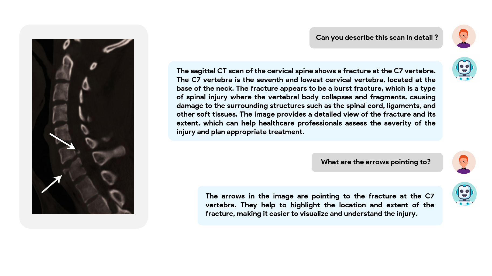
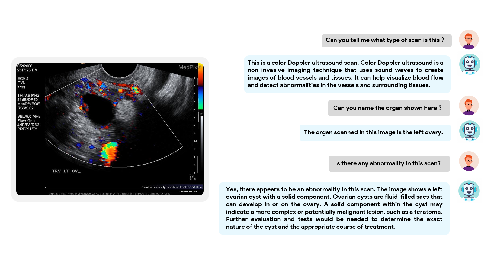

# BiMediX2 : Bio-Medical EXpert LMM with English and Arabic Language Capabilities

    

#### [Sahal Shaji Mullappilly](https://scholar.google.com/citations?user=LJWxVpUAAAAJ&hl=en)\*, [Mohammed Irfan K](https://scholar.google.com/citations?user=GJp0keYAAAAJ&hl=en)*, [Sara Pieri](https://scholar.google.com/citations?user=jLNKLsgAAAAJ&hl=en&oi=ao), [Fahad Khan](https://sites.google.com/view/fahadkhans/home), [Rao Muhammad Anwer](https://scholar.google.com/citations?hl=en&authuser=1&user=_KlvMVoAAAAJ), [Salman Khan](https://salman-h-khan.github.io/), [Timothy  Baldwin](https://scholar.google.com/citations?user=wjBD1dkAAAAJ&hl=en), and [Hisham Cholakkal](https://scholar.google.com/citations?hl=en&user=bZ3YBRcAAAAJ)

\**Equally contributing first authors*

#### **Mohamed Bin Zayed University of Artificial Intelligence (MBZUAI), UAE**

## 	👩‍⚕️ Overview

Introducing **BiMediX2**, the first bilingual medical LLM and LMM based on Llama3.1, designed for seamless interaction in both English and Arabic. BiMediX2 facilitates a wide range of medical interactions, including multi-turn chats, multiple-choice question answering, open-ended question answering, along with the ability to understand and analyze medical images. Our model outperforms GPT-4 on English medical benchmarks and achieves state-of-the-art results in various Medical Multimodal evaluations thanks to the high-quality Arabic-English bilingual healthcare dataset and instruction sets. 

Our models and datasets will be publicly released in HuggingFace 🤗.

---

## 🏆 Contributions

Our contributions are as follows: 

**Arabic-English Bilingual Healthcare LLM**
- BiMediX2 is the first medical LLM based on Llama3.1 to achieve excellent results on English, Arabic, and bilingual text-based medical LLM benchmarks.
- On English benchmarks, our BiMediX2 LLM outperform GPT4 by an average score of more than 9% across 10 medical datasets.
- We created high-quality Arabic-English bilingual medical instruction sets using a semi-automated translation pipeline with Llama3 and GPT-3.5, complemented by manual verification. BiMediX2 is instruction-tuned with these bilingual instruction sets.
- Similar to our previous BiMediX version, BiMediX2 supports soliciting follow-up questions to gather more information about patient symptoms.

**BiMediX2 VLM: Extension to Medical Image Modalities**
- We created an Arabic-English instruction set with 120k image-text pairs across different medical image modalities to train BiMediX2 VLM.
- Our model supports multiple medical image modalities as input, enabling users to upload medical images and clarify their questions in both Arabic and English.
- We developed the first Arabic medical VLM evaluation benchmark that evaluates VLMs across different imaging modalities.
- Our BiMediX2 VLM achieves state-of-the-art results on medical English and Arabic VLM evaluation benchmarks.

## 🌟 Examples

